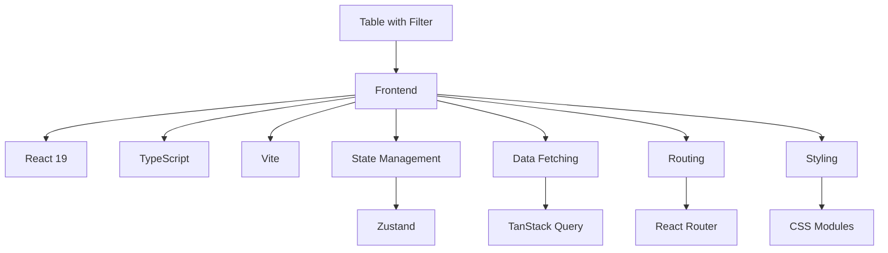
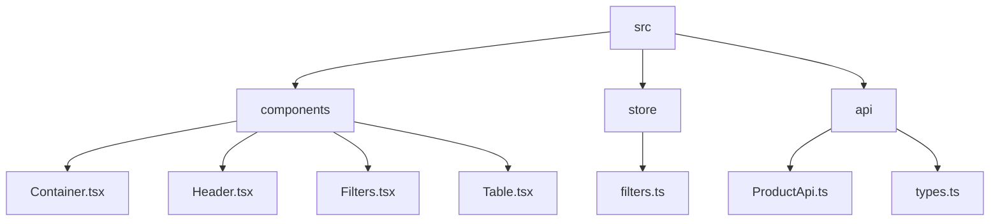
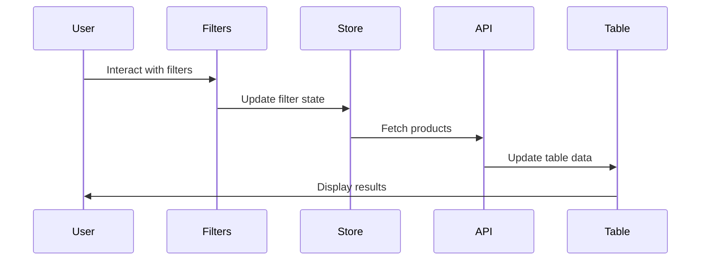
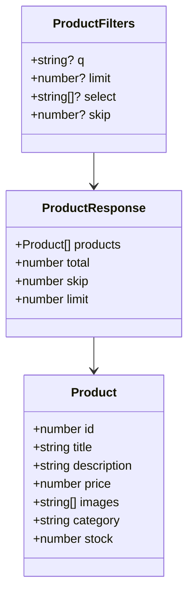
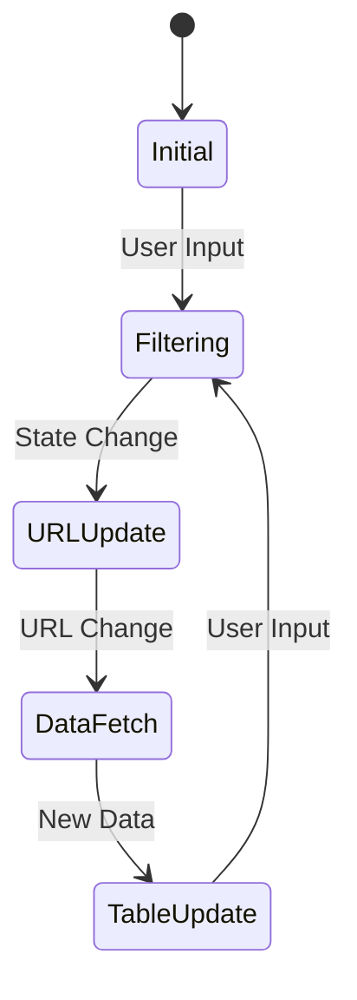
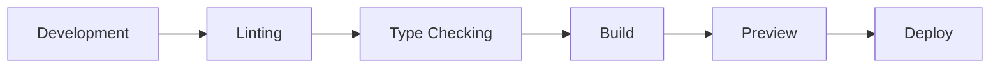

# Table with Filter

A modern React application that implements a product table with advanced filtering capabilities. Built with TypeScript, Vite, and modern React practices.

## 🚀 Features

- Product listing with filtering capabilities
- Real-time search functionality
- Pagination support
- Responsive design
- Dark/Light mode support
- URL-based filter state management
- Type-safe development with TypeScript

## 📦 Tech Stack



## 🏗️ Project Structure



## 🔄 Data Flow



## 🛠️ Setup and Installation

1. Clone the repository
2. Install dependencies:
```bash
bun install
```
3. Start the development server:
```bash
bun run dev
```

## 📝 API Integration

The application integrates with the DummyJSON API for product data. The API supports:

- Search functionality
- Pagination
- Field selection
- Limit control

### API Types



## 🎨 Component Architecture

### Filters Component
- Manages search queries
- Handles field selection
- Controls pagination
- Updates URL parameters

### Table Component
- Displays product data
- Implements responsive grid layout
- Shows product images and details
- Handles loading states

## 🔒 State Management

The application uses Zustand for state management, with a focus on:

- URL synchronization
- Filter state persistence
- Real-time updates
- Type-safe state management



## 🎯 Development Guidelines

1. **TypeScript**: Maintain strict type checking
2. **Component Structure**: Follow functional component patterns
3. **State Management**: Use Zustand for global state
4. **Styling**: Implement CSS Modules for component styles
5. **API Integration**: Use TanStack Query for data fetching

## 📚 Dependencies

- React 19.1.0
- TypeScript
- Vite
- Zustand 5.0.3
- TanStack Query 5.75.0
- React Router 7.5.3
- ESLint
- CSS Modules

## 🔄 Development Workflow



## 📄 License

MIT License - feel free to use this project as a template for your own applications.
